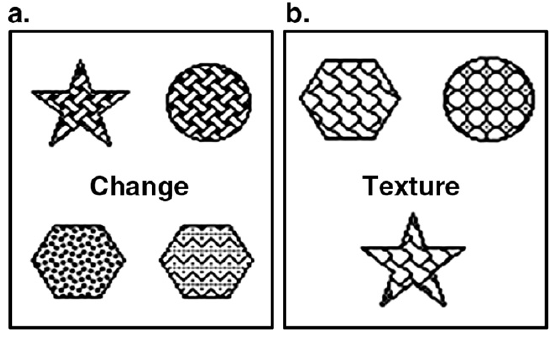
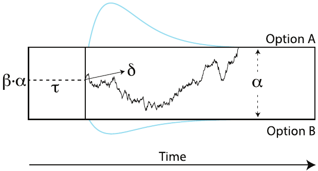
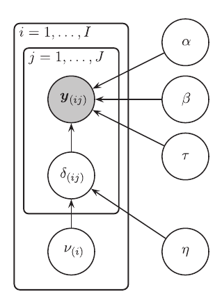
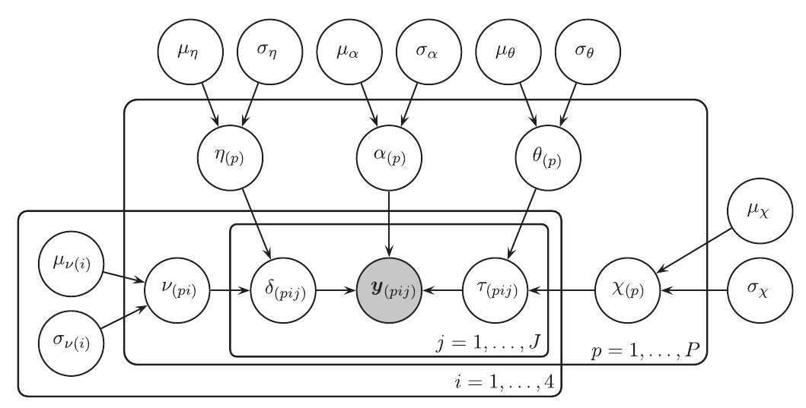

```{r setup, include=FALSE}
options(htmltools.dir.version = FALSE)
```

```{r xaringan-extra, echo = FALSE}
xaringanExtra::use_tile_view()

xaringanExtra::use_fit_screen()

xaringanExtra::use_extra_styles(
  hover_code_line = TRUE,         #<<
  mute_unhighlighted_code = TRUE  #<<
)

htmltools::tagList(
  xaringanExtra::use_clipboard(
    button_text = "<i class=\"fa fa-clipboard\"></i>",
    success_text = "<i class=\"fa fa-check\" style=\"color: #90BE6D\"></i>",
    error_text = "<i class=\"fa fa-times-circle\" style=\"color: #F94144\"></i>"
  ),
  rmarkdown::html_dependency_font_awesome()
)
```

```{r load-tidy, echo = FALSE, message = FALSE, warning = FALSE}
library(tidyverse)
#library(flipbookr)
#knitr::opts_chunk$set(fig.width = 6, message = FALSE, 
#                      warning = FALSE, comment = "", 
#                      cache = F)
#link <- "https://raw.githubusercontent.com/ManuelVU/psych-10c-data/main/example.csv"
#memory <- read_csv(file = link)
```

class: middle, center

# Week 1 Presentation

---

## Human Connectome Project (HCP) 

--

Collection of behavioral and neuroimaging measures for a wide range of processes.

--

**Goals:** 

--

- Identify patterns of structural and functional connectivity in the healthy adult human brain.

--

- Data available for biomedical research.


---

## Relational-Matching Task (ORIGIN)

**Smith et al., (2007). A study about the rostrolateral prefrontal cortex (RLPFC)**

--

- Loosely defined as the lateral portion of Brodmann area (BA) 10.

--

- Associated with multiple cognitive functions across many domains.

--

- **Goal:** 

 - To develop a method for the functional + anatomical localization of RLPFC.

---

## The task



---

## The task (Original)

- Single 13-min session

--

- 24 alternate blocks (12 per condition)

--

  - 8 trials per block (Relational)
  - 10 trials per block (Control)
  
--

- Instructions flashed at the beginning of every block (1s)

 - "Match Change"
 - "Match Shape"
 - "Match Texture"

--

- 6 textures $\times$ 6 shapes.

--

- Stimuli on display until

  - 3500 ms (Relational)
  - 2800 ms (Control) 
  - Response made

---

## The task (Replica on HCP)

- $<$ 3-min sessions

--

- 3 relational blocks

 - 4 trials per block

- 3 control matching blocks

 - 5 trials per block
 
---

## Behavioral data

--

- 82 participants (pilot for HCP).

--

- 27 trials per participant.

--

```{r}
datos <- read.csv("../00_RawMaterial/datos.csv")
head(datos,10)
```

---

## Behavioral data: Response Time per Condition

```{r, echo=FALSE, results='hide'}
RT.control <- datos$rt[which(datos$cond=="control")]
max(RT.control)
min(RT.control)
break1 <- seq(0,2800,100)

RT.relatio <- datos$rt[which(datos$cond!="control")]
max(RT.relatio)
min(RT.relatio)
break2 <- seq(0,3500,100)

c1 <- rgb(173,216,230,max = 255, alpha = 80, names = "lt.blue")
c2 <- rgb(255,192,203, max = 255, alpha = 80, names = "lt.pink")
```

```{r, fig.height=6, echo=FALSE}
hgA <- hist(RT.control, breaks = break1, plot = FALSE) # Save first histogram data
hgB <- hist(RT.relatio, breaks = break2, plot = FALSE) # Save 2nd histogram data

plot(hgA, col = c1, xlim=c(0,3500)) # Plot 1st histogram using a transparent color
plot(hgB, col = c2, add = TRUE) # Add 2nd histogram using different color
legend("topright", c("Control", "Relational"),col = c(c1,c2), pch=16, lwd=5)
```

---

## Behavioral data: Accuracy

```{r, fig.height=6}
accuracy <- tapply(datos$acc, datos$subID, mean)
hist(accuracy, breaks = seq(0.4,1,0.05), col="cyan4", xlim=c(0,1))
```

---

## Behavioral data: Accuracy per Condition

```{r, echo=FALSE, results='hide'}
datAcc <- aggregate(datos$acc, list(datos$subID, datos$cond), mean)
colnames(datAcc) <- c("subID", "cond", "acc")

Acc.control <- datAcc$acc[which(datAcc$cond=="control")]
min(Acc.control)
break1 <- seq(0,1,0.025)

Acc.relatio <- datAcc$acc[which(datAcc$cond!="control")]
min(Acc.relatio)
break2 <- seq(0,1,0.025)

c1 <- rgb(173,216,230,max = 255, alpha = 80, names = "lt.blue")
c2 <- rgb(255,192,203, max = 255, alpha = 80, names = "lt.pink")
```

```{r, fig.height=6, echo=FALSE}
hgA <- hist(Acc.control, breaks = break1, plot = FALSE) # Save first histogram data
hgB <- hist(Acc.relatio, breaks = break2, plot = FALSE) # Save 2nd histogram data

plot(hgA, col = c1, xlim=c(0,1)) # Plot 1st histogram using a transparent color
plot(hgB, col = c2, add = TRUE) # Add 2nd histogram using different color
legend("topleft", c("Control", "Relational"),col = c(c1,c2), pch=16, lwd=5)
```

---

## Drift Diffusion Model

Sequential-sampling model for "rapid" binary decision making.

.pull-left[

]

--

.pull-right[
**Core Assumptions**

- Information is accumulated continuously over time until a response criteria is met.

- RT = Decision Time + Non-decision time

]


---

## Drift Diffusion Model

Sequential-sampling model for "rapid" binary decision making.

.pull-left[

<br>
 



(Johnson et al., 2017)
]

.pull-right[
**Core Assumptions**

- Information is accumulated continuously over time until a response criteria is met.

- RT = Decision Time + Non-decision time

]


---

## Drift Diffusion Model

Sequential-sampling model for "rapid" binary decision making.

.pull-left[

<br>
 


(Johnson et al., 2017)
]

.pull-right[
**Main parameters:**

- $\alpha$ (Decision criteria)

 - Speed-accuracy tradeoff

- $\beta$ (Bias)

 - $z = \beta\alpha$ (Initial point)

- $\tau$ (Non-decision time)

- $\delta$ (Drift rate)

 - $x_t \sim \mbox{N}(\delta,\sigma^2\approx0.1)$
 
 - Difficulty

 - $\delta \sim \mbox{N}(0,\eta)$

]


---

## Drift Diffusion Model

Sequential-sampling model for "rapid" binary decision making.

.pull-left[

<br>
 


(Johnson et al., 2017)
]

.pull-right[

<br>

<br>


$$Y = (C,T)$$

$$Y_t \sim \mbox{Wiener}(\alpha,\beta,\tau,\delta)$$


]


---

## Drift Diffusion Model

Sequential-sampling model for "rapid" binary decision making.

.pull-left[

<br>
 


(Johnson et al., 2017)
]

.pull-right[

- $i^{th}$ participant.

- $j^{th}$ condition.

- $k^{th}$ stimuli.

$$Y_{ijk} = (C_{ijk},T_{ijk})$$

$$Y_{ijk} \sim \mbox{Wiener}(\alpha_{ijk},\beta_{ijk},\tau_{ijk},\delta_{ijk})$$


]


---

## Drift Diffusion Model

Sequential-sampling model for "rapid" binary decision making.

.pull-left[

<br>
 


(Johnson et al., 2017)
]

.pull-right[

- $i^{th}$ participant.

- $j^{th}$ condition.

- $k^{th}$ stimuli.

$$Y_{ijk} = (C_{ijk},T_{ijk})$$

$$Y_{ijk} \sim \mbox{Wiener}(\alpha_{ijk},\beta_{ijk},\tau_{ijk},\delta_{ijk})$$

$$\alpha_{ijk} \sim *$$

$$\beta_{ijk} \sim *$$

$$\tau_{ijk} \sim *$$

$$\delta_{ijk} \sim *$$

]

---

## Drift Diffusion Model  

--

.pull-left[



(Vandekerckhove, Tuerlinckx and Lee, 2011)
]


.pull-right[

<br>

<br>

<br>

$$Y_{ij} \sim \mbox{Wiener}(\alpha,\beta,\tau,\delta_{ij})$$

<br>

$$\delta_{ij} \sim \mbox{Normal}(\nu_i,\eta)$$


]

---

## Proposal: 

--

- Estimate DDM parameters for the relational-matching data.

--

- Implement **hierarchical Bayesian models**.

--

**Phase 1: Describing individual differences**

--

- Identify levels of random variation

--

  - Different parameter distributions by condition
  
  - Different parameter distributions by dimension
  
  - Different parameter distributions by groups-of-people

--

  - Which parameters?

$$Y_{ijk} \sim \mbox{Wiener}(\alpha_{ijk},\beta_{ijk},\tau_{ijk},\delta_{ijk})$$
  
--

- Use Bayes Factors to quantify the evidence 

---

## Proposal: 

--



$$\delta_{pij} \sim \mbox{Normal}(\nu_{pi},\eta_p)$$

$$\tau_{pij} \sim \mbox{Normal}(\theta_{p},\xi_{p})$$


---

## Proposal: 

--

**Phase 2: Explaining the hierarchical structure**

--

- Identify predictors for these parameter variations

--

  - Are there any carry-over effects?
  
  - Do performance change as a function of time?
  
  - Do performance change as a function of immediately previous trial?

```{r, echo=FALSE, results="hide", eval=FALSE}
build_pdf("Week1P_AFCP.html")
```

---

class: middle, center

# Thank you! 