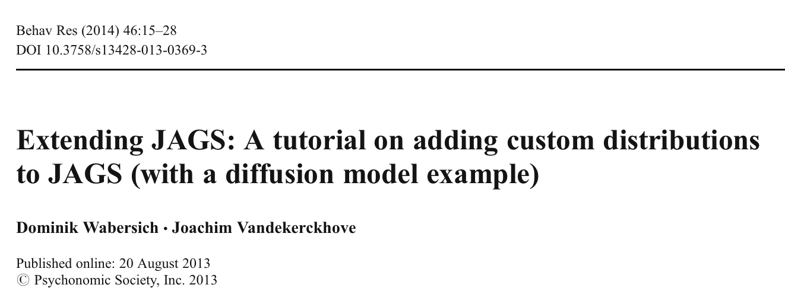
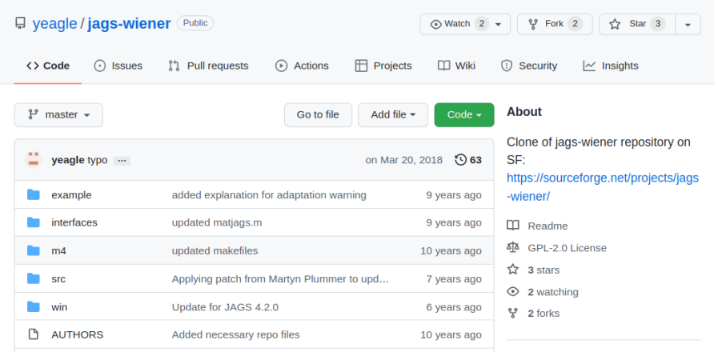
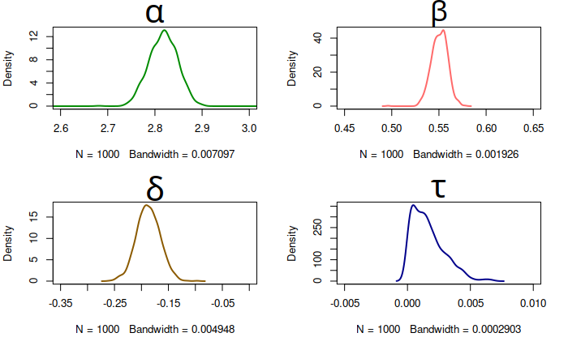
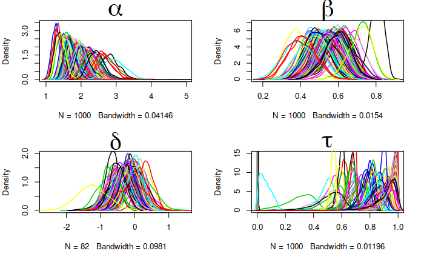
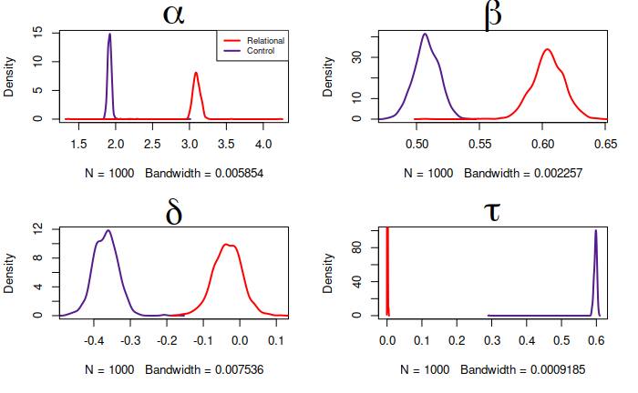
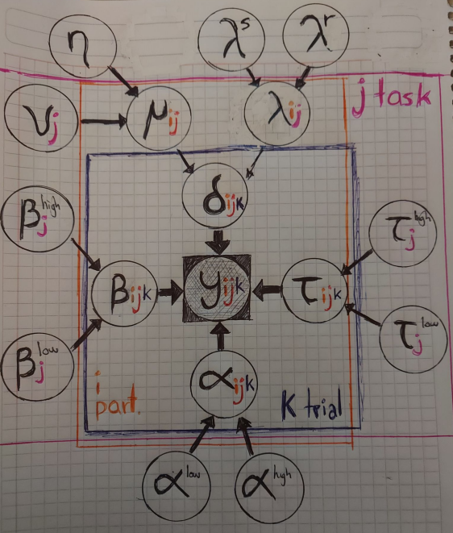
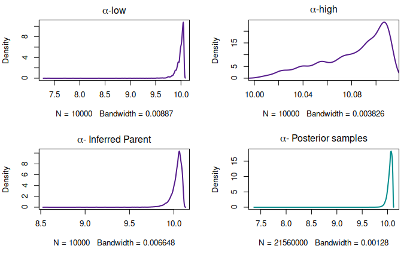
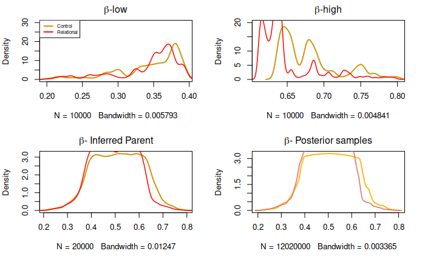
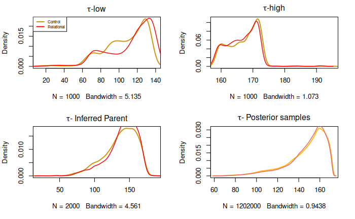
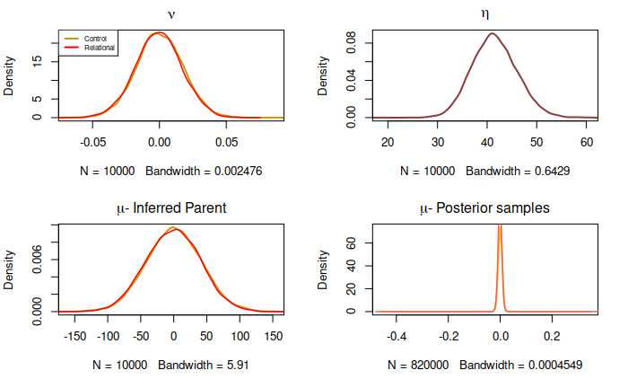

```{r setup, include=FALSE}
options(htmltools.dir.version = FALSE)
```

```{r xaringan-extra, echo = FALSE}
xaringanExtra::use_tile_view()
xaringanExtra::use_fit_screen()
xaringanExtra::use_extra_styles(
  hover_code_line = TRUE,         #<<
  mute_unhighlighted_code = TRUE  #<<
)
htmltools::tagList(
  xaringanExtra::use_clipboard(
    button_text = "<i class=\"fa fa-clipboard\"></i>",
    success_text = "<i class=\"fa fa-check\" style=\"color: #90BE6D\"></i>",
    error_text = "<i class=\"fa fa-times-circle\" style=\"color: #F94144\"></i>"
  ),
  rmarkdown::html_dependency_font_awesome()
)
```

```{r load-tidy, echo = FALSE, message = FALSE, warning = FALSE}
library(tidyverse)
#library(flipbookr)
#knitr::opts_chunk$set(fig.width = 6, message = FALSE, 
#                      warning = FALSE, comment = "", 
#                      cache = F)
#link <- "https://raw.githubusercontent.com/ManuelVU/psych-10c-data/main/example.csv"
#memory <- read_csv(file = link)
```

class: middle, center

# Week 5 Presentation

---

class: middle, center

# First, a recap...

---

## Recap: The task


---

## Recap: The task

- Single 3-min session

--

- 6 alternate blocks (3 per condition)

--

  - 4 trials per block (Relational)
  - 5 trials per block (Control)
  
--

- Instructions flashed at the beginning of every block (1s)

 - "Match Change"
 - "Match Shape"
 - "Match Texture"

--

- 6 textures $\times$ 6 shapes.

--

- Stimuli on display until

  - 3500 ms (Relational)
  - 2800 ms (Control) 
  - Response made

--

- 82 participants (pilot for HCP).

---

## Recap: The data

```{r}
datos <- read.csv("../00_RawMaterial/datos.csv")
head(datos,10)
```

---

## Recap: Drift Diffusion Model

Sequential-sampling model for "rapid" binary decision making.

.pull-left[

<br>
 


(Johnson et al., 2017)
]

.pull-right[

<br>

<br>

$$Y_{i} = (\mbox{Choice}_{i},\mbox{RT}_{i})$$
<br>

$$Y_{i} \sim \mbox{Wiener}(\alpha,\beta,\tau,\delta)$$


]


---

class: middle, center

# Back to the present...

---

## 1) Loading the Wiener distribution



---

## 1) Loading the Wiener distribution



---

## 1) Loading the Wiener distribution

1. Clone repository

2. Locate JAGS directory in your computer

3. Compile the content of the cloned repository

4. Load the module manually into R, along with rjags.

---

## 2) Wiener module: Data preparation

Sequential-sampling model for "rapid" binary decision making.

.pull-left[

<br>

<br>

$$Y_{i} = (\mbox{Choice}_{i},\mbox{RT}_{i})$$
<br>

$$Y_{i} \sim \mbox{Wiener}(\alpha,\beta,\tau,\delta)$$

]

--

.pull-right[

<br>

<br>

```{r, eval=FALSE}
Y<-RT
Y[C==0] <- -RT[C==0]
```

<br>

]

---

## 2) Wiener module: Basic example

<br>

<br>

```{r,eval=FALSE}
model {
  for (i in 1:N) {
    Y[i] ~ dwiener(alpha,tau,beta,delta)
  }
  alpha ~ dunif(-5,5)
  tau ~ dunif(0,1)
  beta ~ dunif(0,1)
  delta ~ dunif(-5,5)
}
```

---

## 2) Wiener module: Basic example

<br>



---

## 2) Wiener module: How to interpret? Try 1

A simple extension where we assume responses recorded **for each participant** can be modeled by their very own Wiener process, regardless of the task.

<br>

```{r,eval=FALSE}
model {
  for (i in 1:N) {
    Y[i] ~ dwiener(alpha[sub[i]],tau[sub[i]],beta[sub[i]],delta[sub[i]])
  }
  for (k in 1:I) {
  alpha[k] ~ dunif(-5,5)
  tau[k] ~ dunif(0,1)
  beta[k] ~ dunif(0,1)
  delta[k] ~ dunif(-5,5)
  }
}
```

---

## 2) Wiener module: How to interpret? Try 1

<br>



---

## 2) Wiener module: How to interpret? Try 2

A simple extension where we merge observations collected across participants to characterize a Wiener process **per task**

<br>

```{r,eval=FALSE}
model {
  for (i in 1:N) {
    Y[i] ~ dwiener(alpha[task[i]],tau[task[i]],beta[task[i]],delta[task[i]])
  }
  for (j in 1:J) {
  alpha[j] ~ dunif(-5,5)
  tau[j] ~ dunif(0,1)
  beta[j] ~ dunif(0,1)
  delta[j] ~ dunif(-5,5)
  }
}
```

---

## 2) Wiener module: How to interpret? Try 2

<br>



---

# The current model:

--

.pull-right[


<br>

<br>

<br>

<br>

<br>

<br>

<br>

<br>

<br>

<br>

... Please, have an open mind.

]


---

{width=60%}

---

## 2) Current model

.pull-left[

```{r, eval=FALSE}
model {
  #Likelihood
  for (i in 1:N) {
    Y[i] ~ dwiener(alpha[i],tau[i],beta[i],delta[i])
    beta[i] ~ dunif(beta_low[task[i]],beta_high[task[i]])
    tau[i] ~ dunif(tau_low[task[i]],tau_high[task[i]])
    delta[i] ~ dnorm(mu[sub[i],task[i]],lambda[sub[i],task[i]])
    alpha[i] ~ dunif(alpha_low,alpha_high)
  }
  for(a in 1:I){
    for(c in 1:J){
      mu[a,c] ~ dnorm(nu[c],eta)
      lambda[a,c] ~ dgamma(lambda_s,lambda_r)
    }
  }
```
]
--
.pull-right[
```{r, eval=FALSE}
  #Priors
  for (j in 1:J) {
  beta_high[j] ~ dunif(0,1)
  beta_low[j] ~ dunif(0.01,beta_high[j])
  tau_high[j] ~ dunif(0.01,1000)
  tau_low[j] ~ dunif(0,tau_high[j])
  nu[j] ~ dnorm(0,10^-5)
  }
  alpha_high ~ dunif(0,1000)
  alpha_low ~ dunif(0.01,alpha_high)
  lambda_s ~ dunif(0,100)
  lambda_r ~ dunif(0,100)
  eta ~ dgamma(2,2)
}
```

]

---

## Output: Alpha



---

## Output: Beta



---

## Output: Tau




---

## Output: Delta


---

## Future directions...?

---