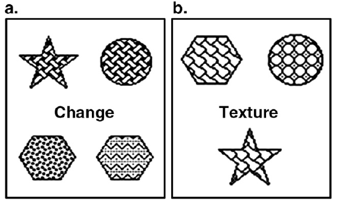
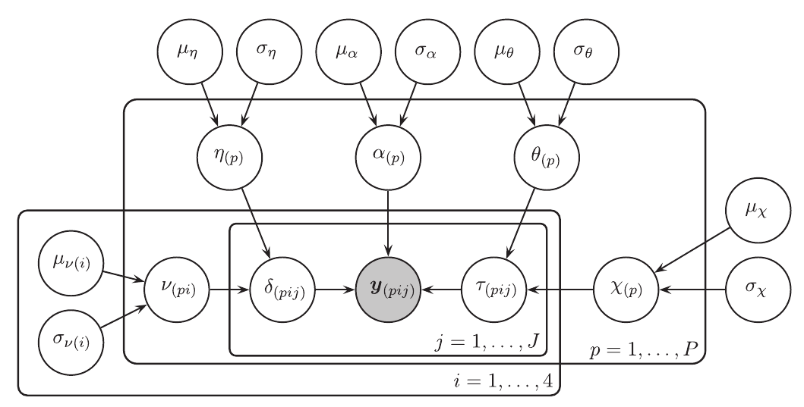
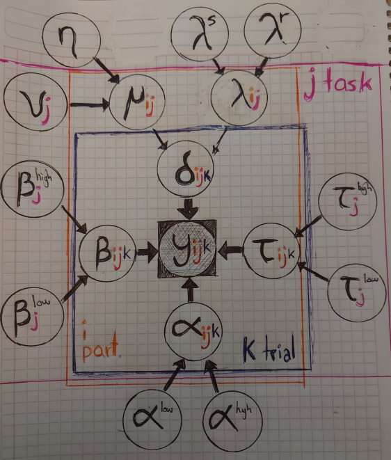

```{r setup, include=FALSE}
options(htmltools.dir.version = FALSE)
```

```{r xaringan-extra, echo = FALSE}
xaringanExtra::use_tile_view()

xaringanExtra::use_fit_screen()

xaringanExtra::use_extra_styles(
  hover_code_line = TRUE,         #<<
  mute_unhighlighted_code = TRUE  #<<
)

htmltools::tagList(
  xaringanExtra::use_clipboard(
    button_text = "<i class=\"fa fa-clipboard\"></i>",
    success_text = "<i class=\"fa fa-check\" style=\"color: #90BE6D\"></i>",
    error_text = "<i class=\"fa fa-times-circle\" style=\"color: #F94144\"></i>"
  ),
  rmarkdown::html_dependency_font_awesome()
)

xaringanExtra::use_xaringan_extra(c("tile_view", "animate_css", "tachyons", "use_fit_screen", "panelset"))
```

```{r load-tidy, echo = FALSE, message = FALSE, warning = FALSE}
library(tidyverse)
#library(flipbookr)
#knitr::opts_chunk$set(fig.width = 6, message = FALSE, 
#                      warning = FALSE, comment = "", 
#                      cache = F)
#link <- "https://raw.githubusercontent.com/ManuelVU/psych-10c-data/main/example.csv"
#memory <- read_csv(file = link)
```

class: middle, center

# Week 8 Presentation

---

class: middle, center

# First, a recap...

---

## Recap: The task

```{r, echo=FALSE, fig.align='center'}

```

---

## Recap: The data

--

- 82 participants

--

<br>

- 27 trials per participant 

  - 12 Relational trials
  - 15 Control trials
  
--

<br>

- 6 textures $\times$ 6 shapes.


--

<br>

- Time constraint on response (2800ms or 3500ms)

--


---

## Recap: Drift Diffusion Model

Sequential-sampling model for "rapid" binary decision making.

.pull-left[

<br>
 


(Johnson et al., 2017)
]

.pull-right[

<br>

<br>

$$Y_{i} = (\mbox{Choice}_{i},\mbox{RT}_{i})$$
<br>

$$Y_{i} \sim \mbox{Wiener}(\alpha,\beta,\tau,\delta)$$


]


---

class: middle, center

# Hierarchical DDM 

(Let me take a step back this time...)

---

## Vandekerckhove, Tuerlinckx & Lee, 2011

```{r, echo=FALSE, fig.align='center'}

```

---

## Vandekerckhove, Tuerlinckx & Lee, 2011

--

<br>

$$y_{pij} \sim Wiener(\alpha_{p},\beta,\tau_{pij},\delta_{pij})$$
<br>

--

.pull-left[

$$\beta = 0.5$$
<br>

$$\tau_{pij} \sim Normal(\theta_p,X_p^2)$$
<br>

$$\delta_{pij} \sim Normal(\nu_{pi}, \eta_{p}^2)$$
<br>

$$\alpha_p \sim Normal(\mu_\alpha,\sigma_\alpha^2)$$

]

--

.pull-right[

<br>

$$\theta_p \sim Normal(\mu_\theta,\sigma_\theta^2)$$

$$\nu_p \sim Normal(\mu_{\nu_i},\sigma_{\nu_i}^2)$$
<br>


$$X_p \sim Normal(\mu_x,\sigma_x^2)$$
$$\eta_p \sim Normal (\mu_\eta,\sigma_\eta^2)$$

]


---

## Vandekerckhove, Tuerlinckx & Lee, 2011

```{r, echo=FALSE, fig.align='center'}

```

---

## Vandekerckhove, Tuerlinckx & Lee, 2011

.panelset[
.panel[.panel-name[Individual diff]
```{r, eval=FALSE}
model {

# Defining population distributions.
    # Alpha = Boundary distance
    mu.alpha ~ dunif(0.02,0.30)
    sigma.alpha ~ dunif(0.0001,0.15)
    prec.alpha <- pow(sigma.alpha,-2)
    # Theta = Mean ND-RT
    mu.theta ~ dunif(0.02,0.70)
    sigma.theta ~ dunif(0.0001,0.15)
    prec.theta <- pow(sigma.theta,-2)
    # Ji = Variance on ND-RT
    mu.chi ~ dunif(0.0001,0.15)
    sigma.chi ~ dunif(0.0001,0.10)
    prec.chi <- pow(sigma.chi,-2)
    # Eta = Variance on drift rate
    mu.eta ~ dunif(0.001,0.45)
    sigma.eta ~ dunif(0.0001,0.15)
    prec.eta <- pow(sigma.eta,-2)
```
]
.panel[.panel-name[Condition-level]

<br>

<br>

```{r, eval=FALSE}
# Condition-level distribution

  for(i in 1:nc){
      # Nu = Mean drift rate
      mu.nu[i] ~ dunif(-.5,.6)
      sigma.nu[i] ~ dunif(0,0.6)
      prec.nu[i] <- pow(sigma.nu[i],-2)
  }
```
]
.panel[.panel-name[Participant-level]

```{r, eval=FALSE}
# Participant-level distributions

  for(p in 1:np){
      # Alpha = Boundary distance
      alpha[p] ~ dnorm(mu.alpha,prec.alpha)I(0.01,0.25)
      # Starting point = alpha*beta
      zeta_init[p] <- alpha[p]*beta
      # Theta = Mean ND-RT
      theta[p] ~ dnorm(mu.theta,prec.theta)I(0.01,0.80)
      # Ji = Variance on ND-RT
      chi[p] ~ dnorm(mu.chi,prec.chi)I(0.00001,0.49)
      prec.tau[p] <- pow(chi[p],-2)
      
      # Eta = Variance on drift rate
      eta[p] ~ dnorm(mu.eta,prec.eta)I(0.00001,0.49)
  
        # For each participant, there's a condition-level distribution
        for(i in 1:nc){
            # Nu = Mean drift rate
            nu[p,i] ~ dnorm(mu.nu[i],prec.nu[i])I(-.7,.7)
      }}
```
]
.panel[.panel-name[Likelihood]

<br>

```{r, eval=FALSE}

  for(j in 1:N){
      # Trial-by-trial variability in ND-RT.
      tau[j] ~ dnorm(theta[pnum[j]],prec.tau[pnum[j]])I(0,)
    
      # Each observation comes from a Wiener distribution with parameters...
      t[j] ~ dwiener.eta(alpha[pnum[j]],       # alpha = boundary distance    
                         tau[j],               # tau = ND-RT
                         zeta_init[pnum[j]],   # alpha*beta = Starting point
                         nu[pnum[j],cond[j]],  # Mean drift rate
                         eta[pnum[j]])         # Variance drift rate
  }}
```

<br>

The code is available <a href="https://supp.apa.org/psycarticles/supplemental/a0021765/met_vandekerckhove_0110_supp2.pdf" target="_blank">here</a>.

]
]

---

## Week 5 proposal

```{r, echo=FALSE, fig.align='center', fig.retina=1.75}

```

---

## Quick revisit

.panelset[

.panel[.panel-name[alpha]

```{r, echo=FALSE, fig.align='center'}

```

]

.panel[.panel-name[beta]

```{r, echo=FALSE, fig.align='center'}

```

]

.panel[.panel-name[tau]

```{r, echo=FALSE, fig.align='center'}

```

]


.panel[.panel-name[mean.delta]

```{r, echo=FALSE, fig.align='center'}

```

]

.panel[.panel-name[var.delta]

```{r, echo=FALSE, fig.align='center'}

```

]

]

---

## Our version of the model.

--

- The standard deviation of the drift rate can be fixed, (Ratcliff & Rouder, 1998;  $s=0.1$)

  - Let's assume a single (but still, **unknown**) value for $\eta$

$$\delta_{pij} \sim Normal(\nu_{pi}, \eta)$$
--

- We substitute the Normal distributions on $\tau$ and $\alpha$ for a Uniform distribution.

$$\tau_{pij} \sim Uniform(\tau_p^{low},\tau_p^{high})$$

$$\alpha_{pij} \sim Uniform(\alpha_p^{low},\alpha_p^{high})$$

--

- All participants, tasks and trials are influenced by a single $\beta$, which is not fixed, but rather:

$$\beta \sim Uniform(0.4,0.7)$$


---

## Our model

```{r, echo=FALSE, fig.align='center', fig.retina=1.75}

```

---

## Posterior distributions

.panelset[

.panel[.panel-name[alpha]

```{r, echo=FALSE, fig.align='center'}

```

]

.panel[.panel-name[beta]

```{r, echo=FALSE, fig.align='center'}

```

]

.panel[.panel-name[tau]

```{r, echo=FALSE, fig.align='center'}

```

]


.panel[.panel-name[drift rate]

```{r, echo=FALSE, fig.align='center'}

```

]

]

---

class: middle, center

# Thank you!