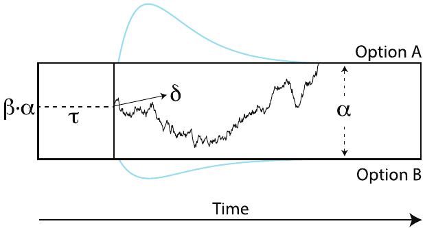

```{r setup, include=FALSE}
knitr::opts_chunk$set(echo = TRUE)
library(cowplot)
```


# Introduction

Data comes from **82 participants** in the pilot of the Human Connectome Project doing the **relational matching task**. This task [@Smith.etal-2007] is known to be effective at localizing the rostrolateral prefrontal cortex (RLPFC) by comparing brain activity observed across two conditions:

- **Relational matching condition:** Participants are presented with two pairs of stimuli and have to indicate whether the elements in the sample pair (Fig 1a, upper half)  differ in the same dimension (*shape*/*texture*) as the elements in the test pair (Fig 1a, bottom half). 

- **Control condition:** Participants are presented with two sample stimuli (Fig 1b, upper half) and a test stimuli (Fig 1b, bottom half). They have to indicate whether the test simuli matches ANY of the sample stimuli in the dimension (*shape*/*texture*) signaled for that trial.


```{r task, echo=FALSE, fig.align='center', fig.retina=3, fig.cap="The relational matching task: a) relational matching condition; b) control condition."}
knitr::include_graphics("./COGS 237 Submissions/Pictures/task_Illustration.png")
```

**Highlights of the experimental design**

- There are 6 levels of both shape and texture ($6\times6=36$ possible stimuli).

- The task was conducted in blocks (3 per condition)

  - The control condition was run in blocks of 5 trials
  
  - The relational matching condition was run in blocks of 4 trials

- Instructions were flashed at the beginning of every block to signal the condition: 1) "Match Change" for the Relational matching task, and 2) "Match Shape" and 3) "Match Texture" for the control condition

- The stimuli remained on display until a response was made or a maximum of 3500 ms (for the relational condition) or 2800 ms (for the control condition) had elapsed.

**Data cleaning notes:**

- Subject ID  735148 is removed from analysis. (Total of **81 participants**)

\clearpage

# Data Description

```{r, echo=FALSE, fig.align='center'}
datos <- read.csv("./RawData/datos.csv")
head(datos,4)
```


**Variables contained in the data set**

- _cond:_ Task (relational/control)
- _dim:_ Dimension signaled during the trial (texture/shape)
- _resp:_ Binary response given by participant
- _corr:_ Binary correct response
- _acc:_ Accuracy (1 when `resp==corr`)
- _rt:_ Response time (measured in milliseconds)

## Details about the data to keep in mind for modeling

- **No missing trials.** We have the same number of observations per participant. All participants completed `r unique(table(datos$subID))` trials.

```{r, echo=FALSE,eval=FALSE}
# All participants completed 27 trials
unique(table(datos$subID))
```
- **Dimension frequency per condition.** 

  - In the control condition, participants were asked to match the texture on $53\%$ of the trials. 

  - On the relational condition, $66\%$ of the trials were identified as Texture trials.


```{r, echo=FALSE}
# There's roughly the same number of Shape/Texture trials on the Control task
# There's 2/3 of Texture trials on the Relational task
tapply(datos$rt,list(datos$cond,datos$dim),length)
```

- **All participants saw the same number of texture/shape trials per condition.** (\textcolor{red}{*Except for subID. 735148*}) 

  - The following table counts the texture/shape trials across conditions for any random participant. These numbers are always the same. 

```{r, echo=FALSE}
# All participants see the same number of Shape/Texture trials per condition
x <- tapply(datos$rt,list(datos$cond,datos$dim, datos$subID),length)
# We can prove this by taking a look at any 3 random participants.
selectRandomPeople <- round(runif(1,1,length(unique(datos$subID))),0)
x[,,selectRandomPeople]
```
  - The one exception is subID 735148, shown below:

```{r}
x[,,"735148"]
```

- **Proportion of Match/Mismatch trials per condition**

  - On the control condition, about $53\%$ of the trials matched.
  
  - On the relational condition, about $42\%$ of the trials matched.

```{r, echo=FALSE}
z <- tapply(datos$rt,list(datos$cond,datos$corr),length)
colnames(z) <- c("Mismatch","Match")
z
```

- **All participants see the same number of Match/Mismatch trials per condition**. (\textcolor{red}{*Except for subID. 735148*})

  - The following table counts the match/mismatch trials across conditions for any random participant. These numbers are always the same. 

```{r, echo=FALSE, fig.align='center'}
# All participants see the same number of Shape/Texture trials per condition
x <- tapply(datos$rt,list(datos$cond,datos$corr,datos$subID),length)
colnames(x) <- c("Mismatch","Match")
# We can prove this by taking a look at any 3 random participants.
selectRandomPeople <- round(runif(1,1,length(unique(datos$subID))),0)
x[,,selectRandomPeople]
```

  - The one exception is subID 735148, shown below:

```{r}
x[,,"735148"]
``` 

```{r, echo=FALSE}
controlTrials <- which(datos$cond=="control")
datos_Control <- datos[controlTrials,]
datos_Relational <- datos[-controlTrials,]
```

- **In the control condition, the proportion of Match/Mismatch trials per dimension is:**

  - $43\%$ of trials Matched in the Shape dimension
  - $62\%$ of trials Marched in the Texture dimension.

```{r, echos=FALSE}
z <- tapply(datos_Control$rt,list(datos_Control$corr,datos_Control$dim),length)
rownames(z) <- c("Mismatch", "Match")
z
```

- At the individual level, all participants see the same number of Match/Mismatch trials with Shape/Texture dimension in the control condition. (\textcolor{red}{*Except for subID. 735148*})


```{r, echo=FALSE, fig.align='center'}
# All participants see the same number of Shape/Texture trials per condition
x <- tapply(datos_Control$rt,list(datos_Control$dim,
                                  datos_Control$corr,
                                  datos_Control$subID),length)
colnames(x) <- c("Mismatch","Match")
# We can prove this by taking a look at any 3 random participants.
selectRandomPeople <- round(runif(1,1,length(unique(datos_Control$subID))),0)
x[,,selectRandomPeople]
```

```{r}
x[,,"735148"]
``` 
- **In the relational condition, the number of Match/Mismatch trials per dimension is:**

  - $50\%$ of trials Matched in the Shape dimension
  - $37\%$ of trials Matched in the Texture dimension.


```{r, echos=FALSE}
z <- tapply(datos_Relational$rt,list(datos_Relational$corr,
                                     datos_Relational$dim),length)
rownames(z) <- c("Mismatch", "Match")
z
```

- At the individual level, all participants see the same number of Match/Mismatch trials with Shape/Texture dimension in the control condition. (\textcolor{red}{*Except for subID. 735148*})

```{r, echo=FALSE, fig.align='center'}
# All participants see the same number of Shape/Texture trials per condition
x <- tapply(datos_Relational$rt,
            list(datos_Relational$dim,
                 datos_Relational$corr,
                 datos_Relational$subID),length)
colnames(x) <- c("Mismatch","Match")
# We can prove this by taking a look at any 3 random participants.
selectRandomPeople <- round(runif(1,1,length(unique(datos_Relational$subID))),0)
x[,,selectRandomPeople]
```

```{r}
x[,,"735148"]
``` 

- **Proportion of responses observed per condition:** The differences in the proportion of Match/Mismatch trials included per condition is somewhat consistent with the proportion of responses observed across all participants.

  - On the control condition, a "Match!" response was found about $48\%$ of the time.
  - On the relational condition, a "Match!" response was observed on $36\%$ of the trials.

```{r, echo=FALSE}
x <- tapply(datos$rt,list(datos$cond,datos$resp),length)
colnames(x) <- c("'Mismatch'","'Match'")
x
```

- **SDT contingency matrices (across all participants):**

On the **control condition**, a high proportion of Hits ($91.8\%$) and an above-chance proportion of Correct rejections ($83.3\%$) were found.

```{r, echo=FALSE}
x <- tapply(datos_Control$rt,list(datos_Control$resp,datos_Control$corr),length)
rownames(x) <- c("Match response","Mismatch response")
colnames(x) <- c("Match stimulus","Mismatch stimulus")
nMatch <- sum(x[,1])
nMistmatch <- sum(x[,2])
x[,1] <- x[,1]/nMatch
x[,2] <- x[,2]/nMistmatch
x
```

However, on the **relational condition**, a lower proportion of Hits ($80.4\%$) is observed, with the Correct rejection rate being barely above chance ($59.3\%$).


```{r, echo=FALSE}
x <- tapply(datos_Relational$rt,list(datos_Relational$resp,datos_Relational$corr),length)
rownames(x) <- c("Match response","Mismatch response")
colnames(x) <- c("Match stimulus","Mismatch stimulus")
nMatch <- sum(x[,1])
nMistmatch <- sum(x[,2])
x[,1] <- x[,1]/nMatch
x[,2] <- x[,2]/nMistmatch
x
```
- **Hit and Correct Rejection rates observed across condition**

\vspace{-0.9in}

```{r, echo=FALSE, fig.align='center',fig.height=4,fig.width=5}
x <- tapply(datos_Control$rt,
            list(datos_Control$resp,datos_Control$corr,datos_Control$subID),length)
rownames(x) <- c("Match response","Mismatch response")
colnames(x) <- c("Match stimulus","Mismatch stimulus")
nMatch <- sum(x[,1,1], na.rm = TRUE)
nMistmatch <- sum(x[,2,1], na.rm=TRUE)
x[,1,] <- x[,1,]/nMatch
x[,2,] <- x[,2,]/nMistmatch
hitRateControl <- x[1,1,]
correjRateControl <- x[2,2,]

x <- tapply(datos_Relational$rt,
            list(datos_Relational$resp,datos_Relational$corr,datos_Relational$subID),
            length)
rownames(x) <- c("Match response","Mismatch response")
colnames(x) <- c("Match stimulus","Mismatch stimulus")
nMatch <- sum(x[,1,1], na.rm = TRUE)
nMistmatch <- sum(x[,2,1], na.rm=TRUE)
x[,1,] <- x[,1,]/nMatch
x[,2,] <- x[,2,]/nMistmatch
hitRateRelational <- x[1,1,]
correjRateRelational <- x[2,2,]

N <- length(hitRateControl)
plot(jitter(rep(1,N)),hitRateControl, pch=16, cex=0.4, ylim=c(0,1), xlim=c(0.5,4.5), col="cyan4",
     axes=FALSE, ann=FALSE)
points(jitter(rep(3,N)),correjRateControl, pch=16,cex=0.4, col="cyan4")
points(jitter(rep(2,N)),hitRateRelational, pch=16,cex=0.4, col="indianred3")
points(jitter(rep(4,N)),correjRateRelational, pch=16,cex=0.4, col="indianred3")
abline(h=0.5, lty=3, col="gray70")
abline(v=2.5)
axis(1,c(1.5,3.5),c("Hit rate", "Correct Rejection rate"))
axis(2, seq(0,1,0.1), seq(0,1,0.1), line=-1.5, las=2)
legend(0.8,0.2, c("Control","Relational"),col=c("cyan4","indianred3"), pch=16, cex=0.5)
```

\vspace{-0.5in}

- **Condition-blocks were presented in the same order across all participants**. (\textcolor{red}{*Except for subID. 735148*}).

```{r, echo=FALSE, fig.width=10}
x <- tapply(datos$trial,list(datos$cond,datos$trial),length)
x <- as.data.frame(x)
rownames(x) <- c("Control:", "Relational:")
x
#data <- datos[-which(datos$subID==735148),]
#tapply(data$trial,list(data$cond,data$trial),length)
```

- **Individual accuracy rate across condition**

\vspace{-0.9in}


```{r, echo=FALSE, fig.align='center',fig.height=4,fig.width=4.5}
mean.acc <- tapply(datos$acc,list(datos$subID,datos$cond),mean)
mean.acc <- as.data.frame(mean.acc)

colCtl <- rgb(0, 100, 150, max = 255, alpha = 50, names = "blue50")
colRlt <- rgb(150, 0, 150, max = 255, alpha = 50, names = "blue50")

hist(mean.acc$control, col=colCtl, breaks=15, main="", xlab="Accuracy rates", ann=F)
hist(mean.acc$relational,add=T, col=colRlt, breaks=15)
legend("topleft",c("Control","Relational"),col = c(colCtl,colRlt), pch=16,
       cex=0.7)
mtext("Accuracy rates",1,line=2)
mtext("Frequency",2,line=2.3)
```

\vspace{-0.4in}

- **Difference in the accuracy rates observed across conditions, for each participant**. 

\vspace{-1in}

```{r, echo=FALSE, fig.align='center',fig.height=3.75,fig.width=8}
mean.acc <- tapply(datos$acc,list(datos$subID,datos$cond),mean)
mean.acc <- as.data.frame(mean.acc)

diff <- mean.acc$control-mean.acc$relational
diff <- sort(diff)
plot(diff, pch=15, col="green4", cex=0.8, ylab="Control - Relational", xlab="",
     main="", cex.axis=0.8)
points(diff[which(diff<0)],col="red3", pch=15, cex=0.8)
points(18:82,diff[which(diff>0)],col="blue3", pch=15, cex=0.8)
legend("bottomright", c("Relational > Control", "Same across conditions", "Control > Relational"), col=c("red3","green4","blue3"), pch=15, cex=0.8)
abline(h=0, lty=3)
abline(v=17.5, lty=5)
abline(v=14.5, lty=5)
```

\clearpage

- **Individual mean RT observed across conditions**.

\vspace{-1in}


```{r, echo=FALSE, fig.align='center',fig.height=3.75,fig.width=8}
mean.RT <- tapply(datos$rt,list(datos$subID,datos$cond),mean)
mean.RT <- as.data.frame(mean.RT)

hist(mean.RT$relational, col=colRlt, breaks=15, main="",ann=F)
hist(mean.RT$control,add=T, col=colCtl, breaks=15)
legend("topleft",c("Control","Relational"),col = c(colCtl,colRlt), pch=16,
       cex=0.7)
mtext("Response Time",1,line=2)
mtext("Frequency",2,line=2.3)
```


- **Difference in the individual mean RT observed across conditions, for each participant**. 

\vspace{-1in}


```{r, echo=FALSE, fig.align='center',fig.height=4,fig.width=8}
mean.RT <- tapply(datos$rt,list(datos$subID,datos$cond),mean)
mean.RT <- as.data.frame(mean.RT)

diff <- mean.RT$relational-mean.RT$control
diff <- sort(diff)

plot(diff, pch=16, col="blue3", cex=0.8, ylab="Relational-Control", xlab="",
     main="", axes = F)
axis(1,seq(1,82,4),seq(1,82,4))
axis(2,seq(-1000,2000,200),seq(-1000,2000,200), las=2)
abline(h=0,lty=5)
abline(v=7,lty=5)
points(diff[which(diff<0)],col="red3", pch=15, cex=0.8)
points(7,diff[7],col="green4", pch=15, cex=0.8)
legend("bottomright", c("Control > Relational", "Same across conditions", "Relational > Control"), col=c("red3","green4","blue3"), pch=15, cex=0.8, bg = "white")

```

# Data cleaning

```{r}
datos <- datos[-which(datos$subID=="735148")]
```

\clearpage

# The Drift Diffusion Model

The Drift Diffusion Model (DDM) accounts for responses observed in 2-alternative forced choice tasks (2AFC) as the result of a sequential sampling process, characterized by four parameters (See Figure \@ref(fig:DDM)). The core assumption is that agents make these binary decisions by accumulating information until a response threshold is met.

```{r DDM, echo=FALSE, fig.align='center', fig.retina=2, fig.cap="A graphical representation of the accumulation process described by the Drift Diffussion Model. This figure was taken from Johnsen et al. (2017)."}

```

The four parameters used in the DDM to describe this sequential sampling process are described below:


1. **Boundary separation** ($\alpha$). The distance between the upper and lower threshold (i.e. $0 < \alpha$). This parameter is assumed to capture information about the speed-accuracy trade-off elicited by the task design. Larger values of $\alpha$ imply that the agent will need to accumulate a greater amount of information before making a judgment, and thus, responses will be slower. This parameter has been found to be sensitive to task manipulations that incentivize either more accurate or rapid responses.

2. **Bias** ($\beta$). The agent's preference towards the binary choice associated with the upper boundary (i.e. $0 < \beta < 1$). It gets multiplied by $\alpha$ to determine the initial state of the sampling process. Such that, in an extreme case where $\beta=1$, the agent would start their decision process already at the upper boundary (hence, ignoring any information provided in the task and producing their response right away).

   $$\mbox{Starting point} = \beta\alpha$$

3. **Non-decision response time** ($\tau$) From the time elapsed between the onset of the trial and a response being registered, this parameter captures the time that could be attributed to anything other than the decision process. The non-decision time comprises everything from the time it takes to produce the motor response to the time it takes the brain to "read" or "encode" the information they are presented with on every trial.

4. **Drift rate** ($\delta$). This is probably the most important parameter in the model. It captures the mean rate of information acquired per unit of time. It determines the speed of the accumulation process and it defines which of the response thresholds is met first. A peculiarity of this parameter, is that it is often assumed to vary across trials, according to the following rule:

$$\delta_{i} \sim \mbox{Normal}(\mu_\delta,\sigma_\delta)$$

Figure \@ref(fig:DDM) also illustrates a key feature of this model: it accounts for both, the choices made (i.e. the response threshold met after accumulating information) and the Response Time distributions observed across trials (i.e. how long does it take for the system to reach any of these thresholds, according to the variable drift rate).

A nice and convenient feature of the DDM model, is that we can track back the bivariate probability of observing a specific choice at a given RT by using the pdf of the Wiener distribution, with the four parameters discussed above. So that:


$$Y = [\mbox{Choice},\mbox{RT}]$$


$$Y \sim \mbox{Wiener}(\alpha,\beta,\tau,\delta)$$

The Wiener distribution was made available in JAGS by 
@Wabersich.Vandekerckhove-2014a

\clearpage

# JAGS models

```{r, echo=FALSE}
MAP.x <- function(vector){
    x.Density <- density(vector)$x
    y.Density <- density(vector)$y
    MAP = x.Density[y.Density==max(y.Density)]
    MAP = round(MAP,5)
  return(MAP)
}

MAP.y <- function(vector){
    y.Density <- density(vector)$y
    MAP = max(y.Density)
    MAP = round(MAP,5)
  return(MAP)
}

```

## Model 0: Demo

A simple Wiener process is used to model all the observations $Y$.

**Step 1.** We aggregate the information we gathered about the RTs and Accuracy observed into a single vector $Y$ according to the following rule:

\begin{equation}
Y_i = 
\begin{cases} 
+(\mbox{RT}_i) & \text{if } \mbox{resp} = \mbox{Correct} \\
-(\mbox{RT}_i) & \text{if } \mbox{resp} = \mbox{Incorrect}
\end{cases}
\end{equation}


```{r,eval=FALSE}
      datos <- read.csv("./RawData/datos.csv")
      datos <- datos[-which(datos$rt==0),]
      
      N <- nrow(datos)
      RT <- datos$rt/1000
      C <- datos$acc
      
      Y<-RT
      Y[C==0] <- -RT[C==0]
```

**Step 2.** Let us use the DEMO JAGS model provided by @Wabersich.Vandekerckhove-2014a at [this link](https://github.com/yeagle/jags-wiener/blob/master/example/sampling_example/wiener_model.txt)

```{r, eval=FALSE}
      write('
            model {
              for (i in 1:N) {
                Y[i] ~ dwiener(alpha,tau,beta,delta)
              }
              alpha ~ dunif(-5,5)
              tau ~ dunif(0,1)
              beta ~ dunif(0,1)
              delta ~ dunif(-5,5)
      }',  'wiener00.txt')
```

**Step 3.** Load variables, model specifications and start sampling with JAGS.

```{r, eval=FALSE}
dat <- list(Y=Y, N=N)
inits <- list(alpha=1,tau=0.001,beta=0.5,delta=0)

model <- jags.model("./wiener00.txt",data=dat,inits=inits,n.chains=1,n.adapt=0)
samples <- jags.samples(model,c("alpha","tau","beta","delta"),n.iter=1000,thin=1)
```

**Step 4.** Extract sample chains per parameter 

```{r, echo=FALSE}
load("./Models/00_DEMO/Wiener_Y/samples.RData")
```

```{r}
alpha <- samples$alpha[,,]
beta <- samples$beta[,,]
delta <- samples$delta[,,]
tau <- samples$tau[,,]
```

\clearpage

**Step 5.** Make some informative plots!

\vspace{-0.6in}

```{r, echo=FALSE, fig.align='center',fig.height=3.5,fig.width=7, fig.cap=""}
#par(mfrow=c(2,2))  60AFD4
posterior <- delta
MAP.color <- "#F7A8CB"
Mean.color <- "#F7A8CB"
CI.color <- "#F7A8CB"
Ci.color2 <- "#2B8DB3"
plot(density(posterior), lwd=2, col="#60AFD4", ann=F)
points(MAP.x(posterior),MAP.y(posterior), pch=16, col=MAP.color)
abline(v=mean(posterior),lty=5, col=Mean.color)
text(-.149,17.5,paste("MAP:",MAP.x(posterior)),cex=0.8)
points(-.168,17.6, pch=16, col=MAP.color, cex=0.8)
text(-.15,15.75,paste("Mean:",round(mean(posterior),5)),cex=0.8)
lines(c(-0.17,-0.1675),c(15.75,15.75), col=Mean.color, lty=5)
mtext(expression(paste(delta, " - Posterior distribution")),3, line=0)
lowQ <- round(quantile(posterior, c(.025)),3)
upQ <-  round(quantile(posterior, c(.975)),3)
arrows(lowQ, 5, upQ, 5, length = 0.1, angle = 90, code=3, col=CI.color, lwd=2)
text(lowQ+.0105,3.8,"95% CI", cex=0.7, col=Ci.color2)
text(lowQ,6.75,paste(lowQ),cex=0.8)
text(upQ,6.75,paste(upQ),cex=0.8)

```

\vspace{-1.1in}


```{r, echo=FALSE, fig.align='center',fig.height=3.5,fig.width=7, fig.cap="", eval=FALSE}
#par(mfrow=c(2,1))  #60AFD4
posterior <- tau
MAP.color <- "#800080"
Mean.color <- "#800080"
CI.color <- "#A3A3A3"
Ci.color2 <- "#800080"
plot(density(posterior), lwd=2, col="#000000", ann=F)
points(MAP.x(posterior),MAP.y(posterior), pch=16, col=MAP.color)
abline(v=mean(posterior),lty=5, col=Mean.color)
text(0.003,350,paste("MAP:",MAP.x(posterior)),cex=0.8)
points(0.0021,350, pch=16, col=MAP.color, cex=0.8)
text(0.003,315,paste("Mean:",round(mean(posterior),5)),cex=0.8)
lines(c(0.0019,0.0021),c(315,315), col=Mean.color, lty=5)
mtext(expression(paste(tau, " - Posterior distribution")),3, line=0)
lowQ <- round(quantile(posterior, c(.025)),3)
upQ <-  round(quantile(posterior, c(.975)),3)
arrows(lowQ, 200, upQ, 200, length = 0.1, angle = 90, code=3, col=CI.color, lwd=2)
text(lowQ+.0004,180,"95% CI", cex=0.7, col=Ci.color2)
text(lowQ,240,paste(lowQ),cex=0.8)
text(upQ,150,paste(upQ),cex=0.8)
```


```{r, echo=FALSE, fig.align='center',fig.height=3.5,fig.width=7, fig.cap="",eval=FALSE}
#par(mfrow=c(2,2))  60AFD4
posterior <- alpha
MAP.color <- "#1BB3FF"
Mean.color <- "#1BB3FF"
CI.color <- "#FFDA00"
Ci.color2 <- "#FF1B8D"
plot(density(posterior), lwd=2, col="#FF1B8D", ann=F)
points(MAP.x(posterior),MAP.y(posterior), pch=16, col=MAP.color)
abline(v=mean(posterior),lty=5, col=Mean.color)
text(3.2,14,paste("MAP:",MAP.x(posterior)),cex=0.8)
points(2.95,14, pch=16, col=MAP.color, cex=0.8)
text(3.19,12.5,paste("Mean:",round(mean(posterior),5)),cex=0.8)
lines(c(2.95,2.98),c(12.5,12.5), col=Mean.color, lty=5)
mtext(expression(paste(alpha, " - Posterior distribution")),3, line=0)
lowQ <- round(quantile(posterior, c(.025)),3)
upQ <-  round(quantile(posterior, c(.975)),3)
arrows(lowQ, 2, upQ, 2, length = 0.1, angle = 90, code=3, col=CI.color, lwd=2)
text(lowQ+.0004,180,"95% CI", cex=0.7, col=Ci.color2)
text(lowQ+.2,2,paste(lowQ),cex=0.8)
text(upQ-0.2,2,paste(upQ),cex=0.8)

```


```{r, echo=FALSE, fig.align='center',fig.height=3.5,fig.width=7, fig.cap="",eval=FALSE}
#par(mfrow=c(2,2))  60AFD4
posterior <- beta
MAP.color <- "#D60270"
Mean.color <- "#D60270"
CI.color <- "#9B4F96"
Ci.color2 <- "#0038A8"
plot(density(posterior), lwd=2, col="#0038A8", ann=F)
points(MAP.x(posterior),MAP.y(posterior), pch=16, col=MAP.color)
abline(v=mean(posterior),lty=5, col=Mean.color)
text(0.53,44,paste("MAP:",MAP.x(posterior)),cex=0.8)
points(2.95,14, pch=16, col=MAP.color, cex=0.8)
text(0.53,38,paste("Mean:",round(mean(posterior),5)),cex=0.8)
lines(c(2.95,2.98),c(12.5,12.5), col=Mean.color, lty=5)
mtext(expression(paste(beta, " - Posterior distribution")),3, line=0)
lowQ <- round(quantile(posterior, c(.025)),3)
upQ <-  round(quantile(posterior, c(.975)),3)
arrows(lowQ, 20, upQ, 20, length = 0.1, angle = 90, code=3, col=CI.color, lwd=2)
text(lowQ+.005,17,"95% CI", cex=0.7, col=Ci.color2)
text(lowQ,25,paste(lowQ),cex=0.8)
text(upQ,25,paste(upQ),cex=0.8)

```

\clearpage

## Model 1: Hierarchical Drift Diffusion Model

\vspace{-0.6in}

```{r, echo=FALSE}
ggdraw() + 
  draw_image("./Models/GraphicalModels/HierarchicalModel.png", width = 0.4, x = 0.25) + 
  draw_image("./Models/GraphicalModels/HierarchicalModel_math.png", width = 0.3, x = 0.65)
```

\vspace{-0.5in}

For this model we used mostly uninformative priors on the parameters characterizing the population-level distributions, (see JAGS code). These priors were set up to take into consideration the constraints of each parameter. The core assumptions are:

1. **Bias is task dependent, but it's assumed to be the same across participants** ($\beta_j$). There's an uneven amount of Match/Mismatch trials across tasks which *could* explain a task-dependent preference for one of these judgements. But there's not a reason to assume that different participants would come into the experiment with a personal preference towards any of these judgments.

2. **Boundary separation is task dependent, but it's assumed to be the same across participants** ($\alpha_j$). The relational condition requires a higher-order comparison. In this condition, participants are not making a judgment about features, but rather about the relationship across these features. Boundary separation is usually used to capture information about the speed-accuracy trade-off, which *could* differ by task in this case as the maximum amount of time set-up per trial varies across conditions as well.

3. **Non-decision time varies per participant, and it's assumed to be the same across tasks** ($\tau_i$). . The non-decision time captures the time that elapses due to any process (i.e. motor response and stimulus encoding) other than the actual time it takes to acquire enough information to make a judgment. The stimuli presented across task is virtually identical, it's just the task instructions that change. We don't expect a difference in non-decision RTs across tasks, but we may expect individual differences across participants (i.e. some individuals may be quicker to press the button than others).  

4. **There's trial-by-trial variations in the drift rate** ($\delta_{ijk}$). This is a classical assumption when using the Drift Diffusion Model, so that the drift rate varies across trials by being sampled from a Normal distribution with some $\mu_\delta$ and a standard deviation typically fixed at $\sigma_\delta = 0.1$, [@Ratcliff.Rouder-1998]. In this model, however, $\sigma_\delta$ is assumed to be unkown, but fixed across conditions and participants.

5. **We could expect some differences in the mean drift rate across tasks and participants** ($\nu_{ij}$). This is arguably the most important parameter in the model. As described in Section 1, the main reason why these two conditions are presented is because through the comparison of the brain activity observed across them, experimenters are able to locate a specific region of the brain. The higher-order judgment required by the relational task is assumed to activate selective brain regions that are not compromised by the control task. 

\clearpage

**JAGS code**

```{r, eval=FALSE}
"model {
  ###### Trial-by-trial variation
          for (i in 1:N) {
            Y[i] ~ dwiener(alpha[task[i]],tau[subj[i]],beta[task[i]],delta[i])
            delta[i] ~ dnorm(nu[subj[i],task[i]],precDelta)
          }
  
  ###### Task-by-Participant mean drift rate
          for(i in 1:I){
              for(j in 1:J){
                  nu[i,j] ~ dnorm(muNu,precNu)
              }
          }
  
  ###### Task-by-Participant mean drift rate
          for(i in 1:I){
              tau[i] ~ dnorm(muTau,precTau)
          }
  
  ###### Task-by-Participant mean drift rate
          for(j in 1:J){
              alpha[j] ~ dnorm(muAlpha,precAlpha)
              beta[j] ~ dnorm(muBeta,precBeta)
          }
  
  ################ PRIORS
          muBeta ~ dunif(0,1)
          muAlpha ~ dunif(0,500)
          muTau ~ dunif(0,2000)
          muNu ~ dnorm(0,300)
          
          sigmaBeta ~ dunif(0.0001,1000)
          sigmaAlpha ~ dunif(0.0001,1000)
          sigmaTau ~ dunif(0.0001,1000)
          sigmaNu ~ dnorm(0.0001,1000)
          sigmaDelta ~ dnorm(0.0001,1000)
          
          precBeta <- pow(sigmaBeta,-2) 
          precAlpha <- pow(sigmaAlpha,-2) 
          precTau <- pow(sigmaTau,-2) 
          precNu <- pow(sigmaNu,-2) 
          precDelta <- pow(sigmaDelta,-2) 
}"
```


```{r}
load("./Models/01_Hierarchical/Hierarchical_Base/widePriors/samples.RData")
```

```{r, echo=FALSE}
alpha <- samples$alpha[,,]
beta <- samples$beta[,,]
delta <- samples$delta[,,]
tau <- samples$tau[,,]
nu <- samples$nu[,,,]

muAlpha <- samples$muAlpha
muTau <- samples$muTau
muBeta <- samples$muBeta
muNu <- samples$muNu

sigmaAlpha <- samples$sigmaAlpha
sigmaTau <- samples$sigmaTau
sigmaBeta <- samples$sigmaBeta
sigmaNu <- samples$sigmaNu
```

\vspace{2in}

**Task-dependent parameters**

\vspace{-0.5in}

```{r, echo=FALSE, fig.align='center',fig.height=4.5,fig.width=9, fig.cap=""}
par(mfrow=c(1,2))

n <- 1000
post.1 <- beta[1,]
post.1 <- sample(post.1,n)
post.2 <- beta[2,]
post.2 <- sample(post.2,n)

plot(post.1, post.2, xlim=c(0.3,0.7), ylim=c(0.3,0.7), pch=16, cex=0.5,
     ann=F,axes=F, col="#0038A8")
mtext("Control condition",1, line=2)
mtext("Relational condition",2, line=2.2)
mtext(expression(paste(beta, " joint distribution")))
axis(1,seq(0,1,0.05),seq(0,1,0.05), cex.axis=0.6)
axis(2,seq(0,1,0.05),seq(0,1,0.05), las=2, cex.axis=0.6)
abline(0,1, lty=2)
legend("bottomright",paste(n, " samples"), bty = "n", cex=0.8, text.col = "gray40")

post.1 <- alpha[1,]
post.1 <- sample(post.1,n)
post.2 <- alpha[2,]
post.2 <- sample(post.2,n)

plot(post.1, post.2, xlim=c(0,10000), ylim=c(0,10000), pch=16, cex=0.5,
     ann=F,axes=T, col="#FF1B8D")
mtext("Control condition",1, line=2)
mtext("Relational condition",2, line=2.2)
mtext(expression(paste(alpha, " joint distribution")))
axis(1,seq(0,1,0.05),seq(0,1,0.05), cex.axis=0.6)
axis(2,seq(0,1,0.05),seq(0,1,0.05), las=2, cex.axis=0.6)
abline(0,1, lty=2)
legend("bottomright",paste(n, " samples"), bty = "n", cex=0.8, text.col = "gray40")
```

\vspace{-0.7in}

```{r, echo=FALSE, fig.align='center',fig.height=4.5,fig.width=9, fig.cap=""}
par(mfrow=c(1,2))

paramName <- beta
post.1 <- beta[1,]
post.2 <- beta[2,]
colD1 <- "#9B4F96"
colD2 <- "#0038A8"

plot(density(post.1), xlim=c(0.3,0.7), pch=16, cex=0.5,
     ann=F,axes=F, col=colD1)
lines(density(post.2), col=colD2)

points(MAP.x(post.1),MAP.y(post.1), pch=16, col=colD2)
points(MAP.x(post.2),MAP.y(post.2), pch=16, col=colD1)
text(0.365,20,paste("MAP:",round(MAP.x(post.1),3)),cex=0.7)
points(0.31,20, pch=16, col=colD2, cex=0.8)
text(0.365,14,paste("MAP:",round(MAP.x(post.2),3)),cex=0.7)
points(0.31,14, pch=16, col=colD1, cex=0.8)

abline(v=mean(post.1),lty=5, col=colD2)
abline(v=mean(post.2),lty=5, col=colD1)
text(0.37,22,paste("Mean:",round(mean(post.1),3)),cex=0.7)
lines(c(0.3,0.32),c(22,22), col=colD2, lty=5)
text(0.37,16,paste("Mean:",round(mean(post.2),3)),cex=0.7)
lines(c(0.3,0.32),c(16,16), col=colD1, lty=5)

mtext("Density",2, line=2)
mtext(expression(paste(beta)),1, line=2.2)
mtext(expression(paste(beta, " posterior distribution")))
axis(1,seq(0,1,0.05),seq(0,1,0.05), cex.axis=0.6)
axis(2,seq(0,28,2),seq(0,28,2), las=2, cex.axis=0.6)
legend("topleft",c("Control","Relational"),col=c(colD1,colD2), lwd=2,cex=0.7, bty="n")

lowQ <- round(quantile(post.1, c(.025)),3)
upQ <-  round(quantile(post.1, c(.975)),3)
arrows(lowQ, 20, upQ, 20, length = 0.1, angle = 90, code=3, col=colD1)
text(lowQ-0.01,21.5,paste(lowQ),cex=0.8)
text(upQ+0.01,21.5,paste(upQ),cex=0.8)

lowQ <- round(quantile(post.2, c(.025)),3)
upQ <-  round(quantile(post.2, c(.975)),3)
arrows(lowQ, 6, upQ, 6, length = 0.1, angle = 90, code=3, col=colD2)
text(lowQ-0.01,7.5,paste(lowQ),cex=0.8)
text(upQ+0.01,7.5,paste(upQ),cex=0.8)


############################################

post.1 <- alpha[1,]
post.2 <- alpha[2,]
colD1 <- "#9B4F96"
colD2 <- "#0038A8"

plot(density(post.1), xlim=c(0,11000), pch=16, cex=0.5,
     ann=F,axes=F, col=colD1, ylim=c(0,0.0002))
lines(density(post.2), col=colD2)

# points(MAP.x(post.1),MAP.y(post.1), pch=16, col=colD2)
# points(MAP.x(post.2),MAP.y(post.2), pch=16, col=colD1)
# text(0.365,20,paste("MAP:",round(MAP.x(post.1),3)),cex=0.7)
# points(0.31,20, pch=16, col=colD2, cex=0.8)
# text(0.365,14,paste("MAP:",round(MAP.x(post.2),3)),cex=0.7)
# points(0.31,14, pch=16, col=colD1, cex=0.8)

# abline(v=mean(post.1),lty=5, col=colD2)
# abline(v=mean(post.2),lty=5, col=colD1)
# text(0.37,22,paste("Mean:",round(mean(post.1),3)),cex=0.7)
# lines(c(0.3,0.32),c(22,22), col=colD2, lty=5)
# text(0.37,16,paste("Mean:",round(mean(post.2),3)),cex=0.7)
# lines(c(0.3,0.32),c(16,16), col=colD1, lty=5)

mtext("Density",2, line=2)
mtext(expression(paste(alpha)),1, line=2.2)
mtext(expression(paste(alpha, " posterior distribution")))
axis(1,seq(0,10000,1000),seq(0,10000,1000), cex.axis=0.6)
axis(2,seq(0,0.00015,0.00005),seq(0,0.00015,0.00005), las=2, cex.axis=0.6)
legend("topleft",c("Control","Relational"),col=c(colD1,colD2), lwd=2,cex=0.7, bty="n")

lowQ <- round(quantile(post.1, c(.025)),3)
upQ <-  round(quantile(post.1, c(.975)),3)
arrows(lowQ, 20, upQ, 20, length = 0.1, angle = 90, code=3, col=colD1)
text(lowQ-0.01,21.5,paste(lowQ),cex=0.8)
text(upQ+0.01,21.5,paste(upQ),cex=0.8)

lowQ <- round(quantile(post.2, c(.025)),3)
upQ <-  round(quantile(post.2, c(.975)),3)
arrows(lowQ, 6, upQ, 6, length = 0.1, angle = 90, code=3, col=colD2)
text(lowQ-0.01,7.5,paste(lowQ),cex=0.8)
text(upQ+0.01,7.5,paste(upQ),cex=0.8)
```

\vspace{-0.3in}

**Bias per task differs across task** (*Left panels*)

- From the joint posteriors (top-left panel), we can tell that the majority of the random samples plotted show that **$\beta$ is larger in the Relational condition than in the Control condition**. This same pattern can be found in the marginal posterior distributions shown in the bottom-left panel.

- According to the posterior distributions presented in the bottom-left panel: 1) There doesn't seem to be a bias towards any binary choice in the control condition (with both the MAP and mean of $\beta_{\mbox{control}}$ falling at 0.5); 2) A slight bias towards the "Match!" response can be found in the relational condition (with a MAP and mean falling close to $\beta_{\mbox{relational}} = 0.62$)

**Boundary distance is... a mess!** (*Right panels*)

-The interpretation of the $\alpha_j$ parameters is far less straightforward, as the values sampled seemed to be all over the place.

- Both the joint distributions presented in the top-right panel, and the posterior distributions drawn in the bottom-right panel, seem to suggest that the values of $\alpha_j$ extend towards larger values. This may suggest a problem with the values sampled from the posterior, **but changing the priors to change the parameter space did not change the shape nor the "definition" of the posteriors here presented.**

- These ugly priors motivated an extension of this first model, where there's a single $\alpha$ parameter across conditions and participants.


**Participant-dependent parameters**

\vspace{-0.5in}

```{r, echo=FALSE, fig.height=4.5,fig.width=9, fig.cap=""}
I <- nrow(tau)
meanTaus <- apply(tau,1,mean)
orderP <- order(meanTaus)
n <- 500
color <- "#800080"

plot(1:82,ylim=c(min(tau),max(tau)),ann=F,axes=F)
points(1:N,meanTaus[orderP], pch=16, cex=0.8, col=color)
  for(a in 1:I){
      posterior <- tau[orderP[a],]
      length(posterior)
      posterior <- sample(posterior,n,replace=FALSE)
      length(posterior)
      postDensity <- density(posterior)$x
      nDensPts <- length(postDensity)
      points(rep(a,n),posterior, cex=0.1)
  }
mtext("Participant",1,line=2)
mtext(expression(paste(tau)),2,line=2.8,las=2,cex=1.5)
axis(2,seq(800,1400,100),seq(800,1400,100),las=2,line=-0.5,cex.axis=0.7)
axis(1,c(1:I),c(1:I), cex=0.5)
legend("topright","Mean posterior",bty="n", lwd=3, col=color)
```

\vspace{-0.4in}

- There seems to be some individual differences in $\tau_i$ across participants, although not much. This shouldn't be necessarily surprising, as we have only 27 observations per participant.

**Drift rate**

\vspace{-0.5in}

```{r, echo=FALSE, fig.height=4.5,fig.width=9, fig.cap=""}
I <- nrow(nu)
J <- ncol(nu)
meanNus <- apply(nu,1,mean)
orderP <- order(meanNus)
color <- c("#9B4F96","#0038A8")
c <- 1
n <- 500
plot(1:I*J,ylim=c(min(nu),max(nu)),ann=F,axes=F,xlim=c(0,I*J))
    for(a in 1:I){
        for(j in 1:J){
            posterior <- nu[orderP[a],j,]
            posterior <- sample(posterior,n,replace=FALSE)
            postDensity <- density(posterior)$x
            nDensPts <- length(postDensity)
            points(rep(c,n),posterior, cex=0.1, col=color[j])
            points(c,meanNus[orderP[a]], pch=16, cex=0.8, col=color[j])
            c <- c+1
        }
    }
mtext("Participant",1,line=2)
mtext(expression(paste(nu)),2,line=2.8,las=2,cex=1.5)
axis(2,seq(-0.2,0.2,0.05),seq(-0.2,0.2,0.05),las=2,line=-0.5,cex.axis=0.7)
axis(1,seq(1,I*J,2),c(1:I), cex=0.5)
legend("topright",c("Control","Relational"),bty="n", lwd=3, col=color)
```

\vspace{-0.5in}

- With only 15/12 trials for the Control/Relational conditions per participant, there is really not a lot of room to estimate mean drift rates across these two levels of variability. However, I am still surprised by how little the variability observed is!

**Perhaps we can throw more light into it with our next model...**

\clearpage

## Model 2: Single alpha.

In this model, the main change is that now **$\alpha$ is assumed to be shared across participants and conditions.**

\vspace{-0.75in}

```{r, echo=FALSE, fig.align='center'}
ggdraw() + 
  draw_image("./Models/GraphicalModels/HierarchicalModel_alpha.png", width = 0.35, x = 0.25)
```

\vspace{-0.7in}

```{r}
load("./Models/01_Hierarchical/Hierarchical_SingleAlpha/samples.RData")
```

```{r, echo=FALSE}
alpha <- samples$alpha[,,]
beta <- samples$beta[,,]
delta <- samples$delta[,,]
tau <- samples$tau[,,]
nu <- samples$nu[,,,]

muTau <- samples$muTau
muBeta <- samples$muBeta
muNu <- samples$muNu

sigmaTau <- samples$sigmaTau
sigmaBeta <- samples$sigmaBeta
sigmaNu <- samples$sigmaNu
```


**Single $\alpha$ across participants and conditions**

\vspace{-0.2in}


```{r, echo=FALSE, fig.height=4,fig.width=9, fig.cap=""}
#par(mfrow=c(2,2))  60AFD4
posterior <- alpha
MAP.color <- "#1BB3FF"
Mean.color <- "#1BB3FF"
CI.color <- "#FFDA00"
Ci.color2 <- "#FF1B8D"
plot(density(posterior), lwd=2, col="#FF1B8D", ann=F)
points(MAP.x(posterior),MAP.y(posterior), pch=16, col=MAP.color)
abline(v=mean(posterior),lty=5, col=Mean.color)
text(7500,0.0011,paste("MAP:",round(MAP.x(posterior),3)),cex=0.8)
points(7000,0.0011, pch=16, col=MAP.color, cex=0.8)
text(7500,0.00095,paste("Mean:",round(mean(posterior),3)),cex=0.8)
lines(c(6800,7000),c(0.00095,0.00095), col=Mean.color, lty=5)
lowQ <- round(quantile(posterior, c(.025)),3)
upQ <-  round(quantile(posterior, c(.975)),3)
arrows(lowQ, 0.0001, upQ, 0.0001, length = 0.1, angle = 90, code=3, col=CI.color, lwd=3)
text(lowQ+500,0.00015,"95% CI", cex=0.7, col=Ci.color2)
text(lowQ,0.0002,paste(lowQ),cex=0.8)
text(upQ,0.0002,paste(upQ),cex=0.8)

```

\vspace{-0.3in}

**Boundary distance is... looking better (?)**

- Similar to Model 1, we can see that: 1) The 95$\%$ CI covers a wide range of values; 2) The MAP and the mean posterior seem to be much further away than with any other parameter.

- However, if we compare this posterior distribution with those observed in Model 1, we can still note an improvement: There's a clear trend. We can now distinguish easily which values have a higher posterior density.

\vspace{2in}

**Task-dependent parameter**

\vspace{-0.5in}

```{r, echo=FALSE, fig.align='center',fig.height=4.5,fig.width=9, fig.cap=""}
par(mfrow=c(1,2))

n <- 1000
post.1 <- beta[1,]
post.1 <- sample(post.1,n)
post.2 <- beta[2,]
post.2 <- sample(post.2,n)

plot(post.1, post.2, xlim=c(0.3,0.7), ylim=c(0.3,0.7), pch=16, cex=0.5,
     ann=F,axes=F, col="#0038A8")
mtext("Control condition",1, line=2)
mtext("Relational condition",2, line=2.2)
mtext(expression(paste(beta, " joint distribution")))
axis(1,seq(0,1,0.05),seq(0,1,0.05), cex.axis=0.6)
axis(2,seq(0,1,0.05),seq(0,1,0.05), las=2, cex.axis=0.6)
abline(0,1, lty=2)
legend("bottomright",paste(n, " samples"), bty = "n", cex=0.8, text.col = "gray40")


paramName <- beta
post.1 <- beta[1,]
post.2 <- beta[2,]
colD1 <- "#9B4F96"
colD2 <- "#0038A8"

plot(density(post.1), xlim=c(0.3,0.7), pch=16, cex=0.5,
     ann=F,axes=F, col=colD1)
lines(density(post.2), col=colD2)

points(MAP.x(post.1),MAP.y(post.1), pch=16, col=colD2)
points(MAP.x(post.2),MAP.y(post.2), pch=16, col=colD1)
text(0.365,20,paste("MAP:",round(MAP.x(post.1),3)),cex=0.7)
points(0.31,20, pch=16, col=colD2, cex=0.8)
text(0.365,14,paste("MAP:",round(MAP.x(post.2),3)),cex=0.7)
points(0.31,14, pch=16, col=colD1, cex=0.8)

abline(v=mean(post.1),lty=5, col=colD2)
abline(v=mean(post.2),lty=5, col=colD1)
text(0.37,22,paste("Mean:",round(mean(post.1),3)),cex=0.7)
lines(c(0.3,0.32),c(22,22), col=colD2, lty=5)
text(0.37,16,paste("Mean:",round(mean(post.2),3)),cex=0.7)
lines(c(0.3,0.32),c(16,16), col=colD1, lty=5)

mtext("Density",2, line=2)
mtext(expression(paste(beta)),1, line=2.2)
mtext(expression(paste(beta, " posterior distribution")))
axis(1,seq(0,1,0.05),seq(0,1,0.05), cex.axis=0.6)
axis(2,seq(0,28,2),seq(0,28,2), las=2, cex.axis=0.6)
legend("topleft",c("Control","Relational"),col=c(colD1,colD2), lwd=2,cex=0.7, bty="n")

lowQ <- round(quantile(post.1, c(.025)),3)
upQ <-  round(quantile(post.1, c(.975)),3)
arrows(lowQ, 20, upQ, 20, length = 0.1, angle = 90, code=3, col=colD1)
text(lowQ-0.01,21.5,paste(lowQ),cex=0.8)
text(upQ+0.01,21.5,paste(upQ),cex=0.8)

lowQ <- round(quantile(post.2, c(.025)),3)
upQ <-  round(quantile(post.2, c(.975)),3)
arrows(lowQ, 6, upQ, 6, length = 0.1, angle = 90, code=3, col=colD2)
text(lowQ-0.01,7.5,paste(lowQ),cex=0.8)
text(upQ+0.01,7.5,paste(upQ),cex=0.8)
```

\vspace{-0.3in}

**Bias per task differs across task** 

Overall, the posterior samples for the $\beta_j$ parameters seem to be consistent with what we had reported on Model 1. If anything, the only difference is that the evidence for these claims is a little bit stronger this time:

- $\beta$ is larger in the Relational condition than in the Control condition

- There doesn't seem to be a bias towards any binary choice in the control condition

- A slight bias towards the "Match!" response can be found in the relational condition.


**Participant-dependent parameters**

\vspace{-0.5in}

```{r, echo=FALSE, fig.height=4.5,fig.width=9, fig.cap=""}
I <- nrow(tau)
meanTaus <- apply(tau,1,mean)
orderP <- order(meanTaus)
n <- 500
color <- "#800080"

plot(1:82,ylim=c(min(tau),max(tau)),ann=F,axes=F)
points(1:I,meanTaus[orderP], pch=16, cex=0.8, col=color)
  for(a in 1:I){
      posterior <- tau[orderP[a],]
      length(posterior)
      posterior <- sample(posterior,n,replace=FALSE)
      length(posterior)
      postDensity <- density(posterior)$x
      nDensPts <- length(postDensity)
      points(rep(a,n),posterior, cex=0.1)
  }
mtext("Participant",1,line=2)
mtext(expression(paste(tau)),2,line=2.8,las=2,cex=1.5)
axis(2,seq(800,1400,100),seq(800,1400,100),las=2,line=-0.5,cex.axis=0.7)
axis(1,c(1:I),c(1:I), cex=0.5)
legend("topright","Mean posterior",bty="n", lwd=3, col=color)
```

\vspace{-0.4in}

- These results are consistents with those found in Model 1.

\clearpage

**Drift rate**

\vspace{-0.5in}

```{r, echo=FALSE, fig.height=4.5,fig.width=9, fig.cap=""}
I <- nrow(nu)
J <- ncol(nu)
meanNus <- apply(nu,1,mean)
orderP <- order(meanNus)
color <- c("#9B4F96","#0038A8")
c <- 1
n <- 500
plot(1:I*J,ylim=c(min(nu),max(nu)),ann=F,axes=F,xlim=c(0,I*J))
    for(a in 1:I){
        for(j in 1:J){
            posterior <- nu[orderP[a],j,]
            posterior <- sample(posterior,n,replace=FALSE)
            postDensity <- density(posterior)$x
            nDensPts <- length(postDensity)
            points(rep(c,n),posterior, cex=0.1, col=color[j])
            points(c,meanNus[orderP[a]], pch=16, cex=0.8, col=color[j])
            c <- c+1
        }
    }
mtext("Participant",1,line=2)
mtext(expression(paste(nu)),2,line=2.8,las=2,cex=1.5)
axis(2,seq(-0.2,0.2,0.05),seq(-0.2,0.2,0.05),las=2,line=-0.5,cex.axis=0.7)
axis(1,seq(1,I*J,2),c(1:I), cex=0.5)
legend("topright",c("Control","Relational"),bty="n", lwd=3, col=color)
```

\vspace{-0.35in}

Oh no! Once again, there doesn't seem to be a clear structure in the mean drift rate observed across conditions and participants.

I've been puzzled by this last result. A few ideas that I have, include:

1. It seems odd that the posteriors of $\tau$ have such big values (specially, considering the RT distributions presented in Section 1). It doesn't make sense, to me, that the majority of the RT is attributed to non-decision processes. A first approach would be to try different, more restricted priors on $\mu_\tau$ and $\sigma_\tau$

2. Use the information gained from these models to restrict the priors on $\beta_j$, $\alpha$, $\tau_i$ and $\mu_{nu}$

\clearpage

# References

